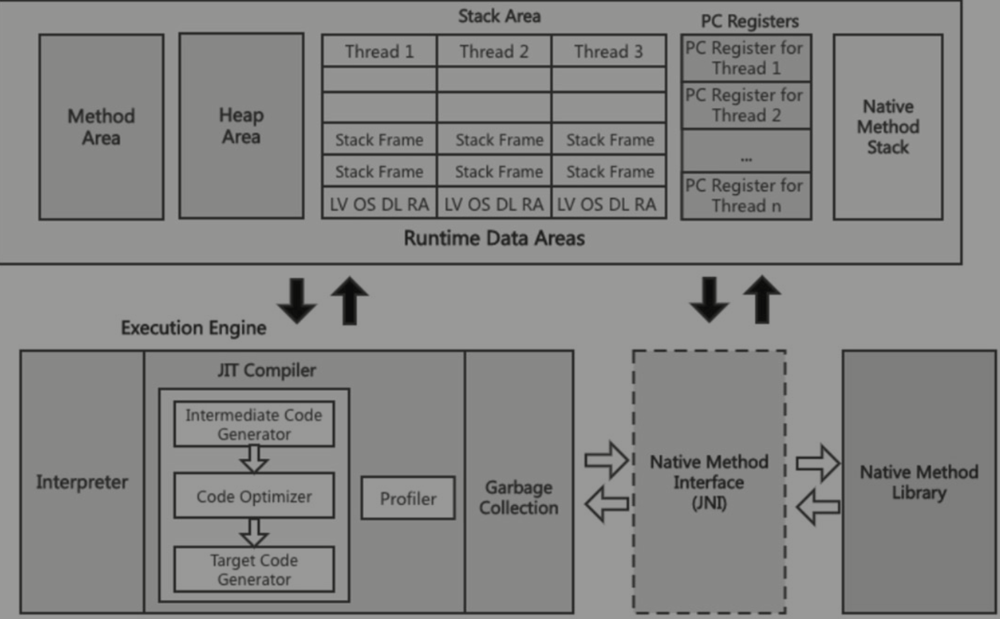

### python&java

主要讨论的是两个语言如何相互调用


#### [graalvm](https://www.graalvm.org/)

开源虚拟机 名字很多 比较关键的概念是 native-image


#### [py4j](https://www.py4j.org/advanced_topics.html#implementing-java-interfaces-from-python-callback)
python 作为 client
java 作为 server


#### net

可以用一些网络的方法进行实现


#### jni

> 最酷的方法

java 通过 jni 调用本地方法 在本地方法中调用 python


##### jvm



##### 类的装载 

java中的数据类型: 基础数据类型 引用数据类型

> 基础数据类型可以直接使用 引用数据类型需要执行 类的加载 才可以使用

类的装载: 将.class 字节码文件 加载到java内存中(虚拟内存)


类的装载分为:
- 加载(loading)
- 链接(linking)
- 初始化(initialize)

**loading**: 
这个阶段通过类加载器ClassLoader实现

1. 读取.class字节码文件 
2. 在方法区创建对应类的数据结构 InstanceKlass(constant pool、虚方法表)
3. 在堆区创建.class对象指向方法区的结构 （Class a = A.class 反射的基础、静态变量）

**linking**: 

1. verification


2. perparation
为静态变量初始化为0


3. resolution
将符号引用(constant pool中)变为直接引用

**initialize**:
执行clinit方法： 这个方法由 静态赋值语句 和 静态语句块 合并

##### ClassLoader

和classloader相关的技术

- spi机制
- 类的热部署
- tomcat类的隔离
- 面试： Delegation Model & Custom ClassLoader
- arthas的底层

类加载器的分类
1.bootstrap class loader : 最底层的classloader(c++编写)
2. extension class loader 
3. application class loader 加载classpath下的类文件

Delegation Model:
类加载器收到加载请求时 委派给 父类的类加载器进行加载
直到 bootstrap class loader

这样可以防止java自己的类被覆盖

`ClassLoader`类 几个重要的函数

```
loadClass: 实现类加载的逻辑 Delegation Model
findClass: 将.class字节码文件读入
defineClass: native interface 将字节码文件加载到 堆区 和 方法区
resolveClass: linking阶段
```

重写loadClass方法 打破算清委派机制
冲写findClass方法 实现从不同的地方加载类

**黑马老师讲了一个特别有意思的点子： 从数据库中加载类**


##### custom jni

native method interface : java的接口 由 c++代码实现
1. 创建JNI 
```java
// MyNativeMethods.java
public class MyNativeMethods {
    public native int myNativeMethod(String parameter);
}
```

2. 生成JNI头文件

`javac MyNativeMethods.java -h .`
会生成一个c++头文件


3. 实现本地方法

```c++
#include "MyNativeMethods.h"
#include <jni.h>
#include <iostream>

JNIEXPORT jint JNICALL Java_MyNativeMethods_myNativeMethod
  (JNIEnv *env, jobject thisObj, jstring parameter) {
    const char *nativeString = env->GetStringUTFChars(parameter, 0);
    std::cout << "Received string: " << nativeString << std::endl;
    
    env->ReleaseStringUTFChars(parameter, nativeString);
    return 123;
}
```

4. 编译本地代码生成动态库
`g++ -shared -fPIC -o libmynativemethods.so -I${JAVA_HOME}/include -I${JAVA_HOME}/include/darwin MyNativeMethods.cpp -arch x86_64
`

5. 在Java代码中加载库


```java
public class Hello3 {
  static {
    System.loadLibrary("mynativemethods");
  }
  public static void main(String args[]) {
    MyNativeMethods myNativeMethods = new MyNativeMethods();
    int result = myNativeMethods.myNativeMethod("Hello from Java");
    System.out.println("Native method returned: " + result);
  }
}
```

编译(`javac`)成字节码 运行(`java -Djava.library.path=/Users/yangqi/Code/tmp Hello3`)字节码

##### C++&python

`g++ main.cpp -o main -I/Users/yangqi/.pyenv/versions/3.10.13/include/python3.10 -L/Users/yangqi/.pyenv/versions/3.10.13/lib -lpython3.10`


查看python头文件和库
pyenv工具中的指令
```bash
# 获取包含目录（头文件位置）
python3-config --includes

# 获取库目录
python3-config --libs

# 获取链接标志
python3-config --ldflags
```
```c++
#include <Python.h>

int main() {
  Py_Initialize();
  PyRun_SimpleString("import numpy as np");
  PyRun_SimpleString("arr = np.array([1, 2, 3, 4, 5])");
  PyRun_SimpleString("print(arr)");
  Py_Finalize();
  return 0;
}
```

c++调用python代码

```c++
#include <Python.h>
#include <iostream>

void addPathToSysPath(const char* path) {
    PyObject* sysPath = PySys_GetObject("path"); 
    PyObject* pathObj = PyUnicode_FromString(path);
    PyList_Append(sysPath, pathObj);
    Py_DECREF(pathObj);
}

PyObject* importPythonModule(const char* moduleName) {
    PyObject* moduleNameObj = PyUnicode_FromString(moduleName);
    PyObject* module = PyImport_Import(moduleNameObj);
    Py_DECREF(moduleNameObj);
    return module; // 去除了对module是否为空的检查
}

PyObject* getFunctionFromModule(PyObject* module, const char* functionName) {
    PyObject* function = PyObject_GetAttrString(module, functionName);
    return function; // 去除了对function是否可调用的检查
}

void callFunctionWithoutArgs(PyObject* function) {
    PyObject* result = PyObject_CallObject(function, NULL); 
    Py_XDECREF(result); // 简化了错误处理
}

int main() {
    Py_Initialize();
    addPathToSysPath("."); // 假设初始检查总是成功

    PyObject* myModule = importPythonModule("opencv_test");
    PyObject* myFunction = getFunctionFromModule(myModule, "capture_video");
    callFunctionWithoutArgs(myFunction);

    Py_DECREF(myFunction);
    Py_DECREF(myModule);
    Py_Finalize();
    return 0;
}
```

步骤总结:
1. 写java native接口, 编译成.h 

2. 写.cpp 实现.h中的方法

3. 编译.cpp 到 .so 

4. 编写.java 在静态代码块中引入.so 将 .java native 编译好的class 引入

5. 编译运行


