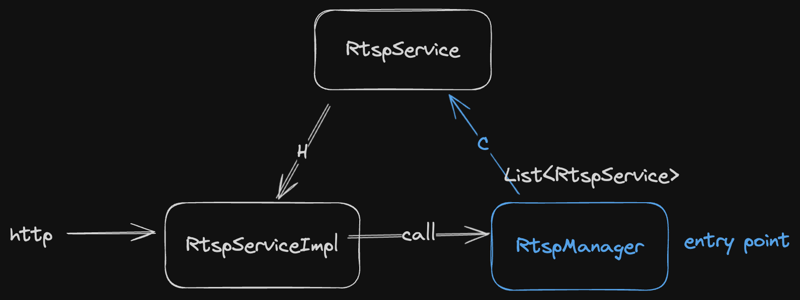

### python&java

主要讨论的是两个语言如何相互调用

#### [graalvm](https://www.graalvm.org/)

开源虚拟机 名字很多 比较关键的概念是 native-image

#### [py4j](https://www.py4j.org/advanced_topics.html#implementing-java-interfaces-from-python-callback)

#### net

可以用一些网络的方法进行实现
