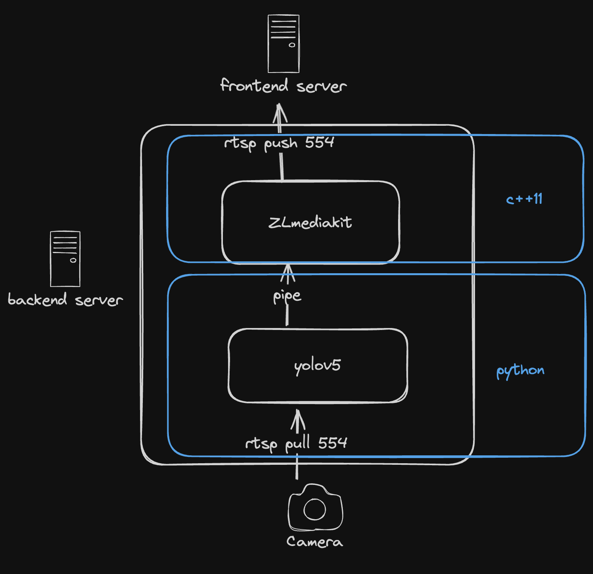
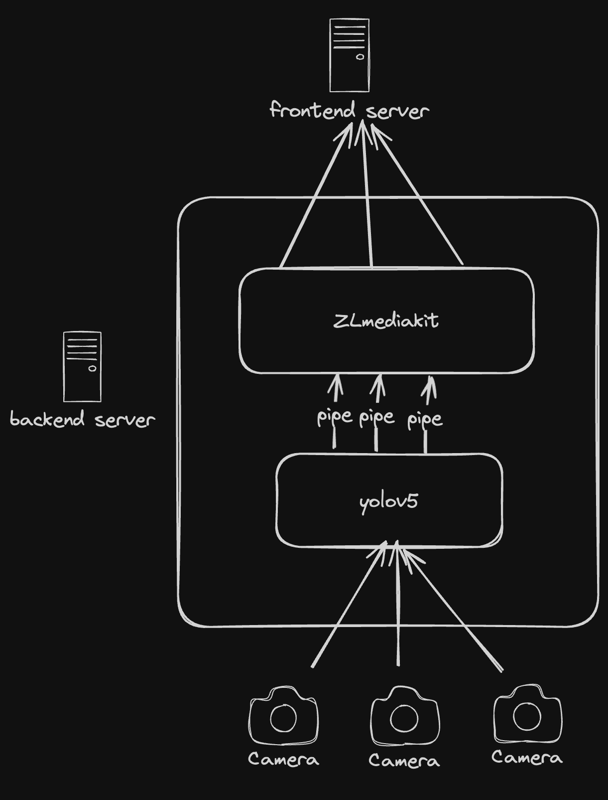

### streaming media

需要完成一个摄像头流媒体服务器的搭建

---

#### server

##### 转发
1. 将摄像头拉流
2. 从本地进行流推送

##### 处理

1. 在本地服务器进行yolov处理
2. 推送处理的流

##### 触发

满足条件时需要触发一个函数

##### 存储

将(处理后的)流进行存储

---

#### tools

##### [ruoyi](https://github.com/yangzongzhuan/RuoYi)

在ruoyi上进行二次开发

##### [ZLMediaKit](https://github.com/ZLMediaKit/ZLMediaKit)

流媒体服务器框架

##### [ffmpeg](https://github.com/FFmpeg/FFmpeg)

流处理和转换工具
提供了ffplay作为流打开工具

##### [yolov](https://github.com/ultralytics/yolov5)

对视频流进行处理

##### [flask](https://github.com/pallets/flask)

搭建简单的python web服务器

---

#### arch

##### 单个摄像头架构

##### 多个摄像头架构

---

#### concept

##### web proxy

* rtsp: 应用层，基于tcp，用于控制播放、暂停、定位
* rtp: 应用层，基于udp，用于传输流媒体数据
* rtcp: 应用层，rtp的控制协议，用来确保流媒体数据的传输质量
* websocket: 基于tcp，全双工通行

---

#### other

##### bash script
编写start.sh stop.sh

##### thread
卡顿可以用threadpool优化得非常好

---

#### thinking

##### ZLMediaKit和端口

地位
ZLMediaKit对于流媒体服务器 = nginx对于web服务器 = tomcat对于java服务器

一个rtsp请求相当于一个线程(不是一个进程)
一个端口(554 80 8080)对应一个进程
一个进程包含多个线程
一个端口可以处理多个线程
具体怎么处理需要看 ZLMediaKit nginx tomcat 设置和内部逻辑

##### FFmpeg

FFmpeg用来处理rtsp请求和发送rtsp请求

游览器对于http = ffmpeg对于rtsp

ffmpeg 处理二进制内容转化为视频
游览器 处理文本内容转化为网页

##### http和websocket

http 传输文本 
websocket 传输文本和二进制

http 是请求响应式
websocket 是全双工通信

都基于tcp

##### yolov8

> 避免使用过老的工具 除非迫不得已(新版存在bug) 在有yolov8的情况下 别使用yolov5

使用非常简单
[官方的一些小案例](https://github.com/ultralytics/ultralytics/blob/604b9d07946b093a79ff899b1ead463b9ef7be4a/docs/en/guides/security-alarm-system.md?plain=1#L118)
主要的是一些学习思想
1. 官方文档，学习一个新的工具，首先需要看官方文档，download -> quickstart -> code
2. github 搜索代码，片段代码放入github搜
3. chatgpt 2和3 一起使用，想尽办法一个功能一个功能实现
4. 出现bug: 搜索(中文 英文) \ chatgpt \ github issue 

