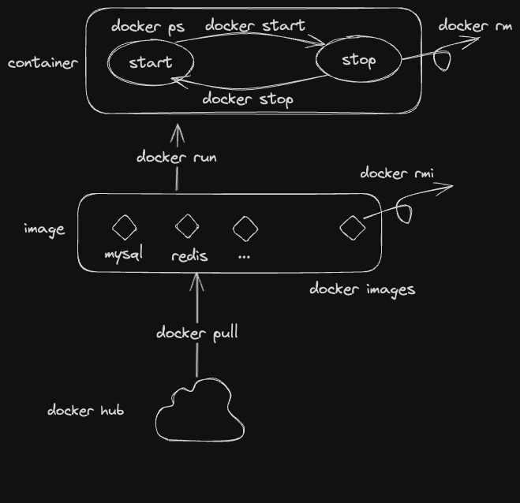

### docker
> 配环境问题已经困扰了我不是一天两天，多懂一点docker可以少很多麻烦

[dockerhub](https://hub.docker.com/)

#### 概念
- container
- image
- volume
- network

#### 指令


```bash
docker pull
docker images
docker run
docker start
docker stop
docker rm
docker rmi
...
```

在.zshrc中做一个影射
```bash
alias docker-ps="docker ps --format 'table {{.ID}}\t{{.Image}}\t{{.Ports}}\t{{.Status}}\t{{.Names}}'"
alias docker-ps-a="docker ps --format 'table {{.ID}}\t{{.Image}}\t{{.Ports}}\t{{.Status}}\t{{.Names}}' -a"
```

关于docker run的一些详细参数
```
-d: 在后台运行
-p: 指定映射端口 暴露端口:容器内端口
--name: 指定contain名字
-v: 进行挂载，~/myvolume:usr/path or volume:/usr/path
-e: 添加环境变量
```

*mac下挂载volume volume存储在docker自己创建的虚拟机中*

#### dockerfile


#### dockercompose