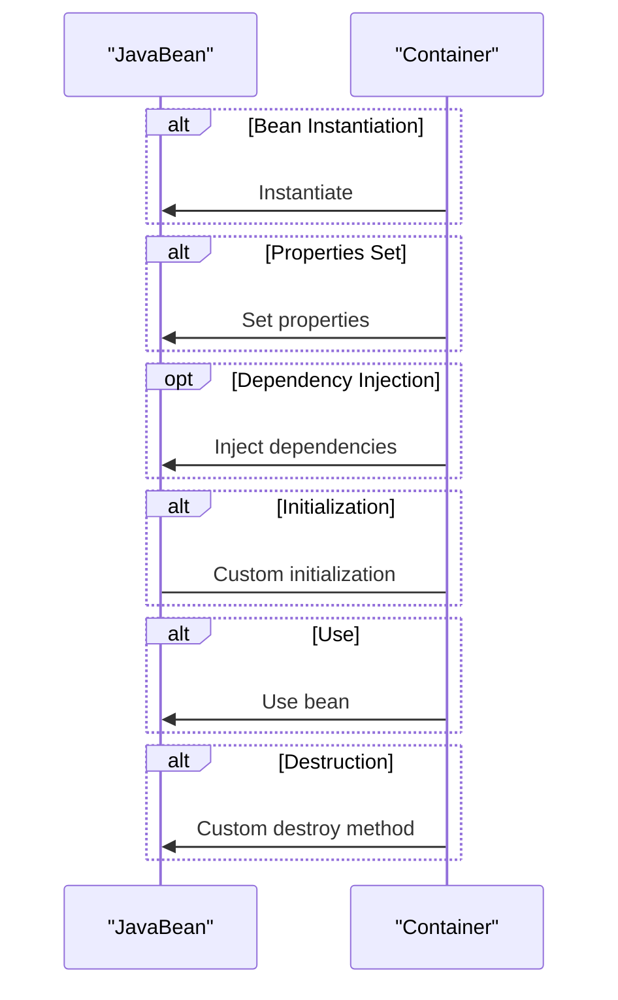
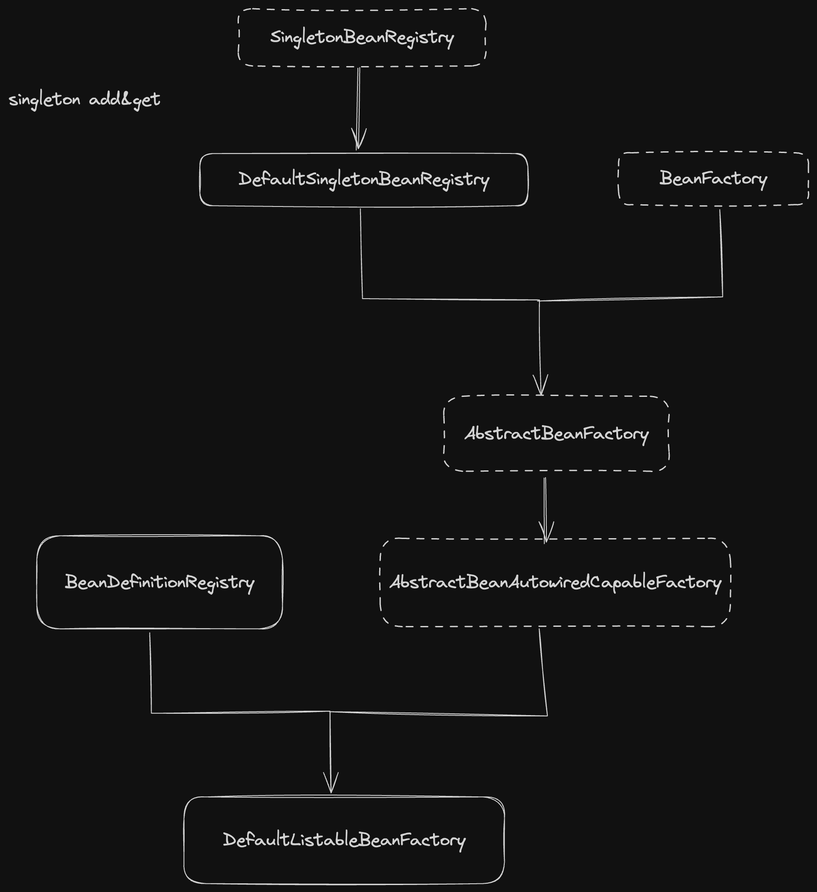

### spring

[mini-spring](https://github.com/DerekYRC/mini-spring/blob/main/changelog.md#%E5%9F%BA%E7%A1%80%E7%AF%87IoC)学习记录

#### bean scope

通过`@scope`来修改bean的作用域

1. singleton 
默认作用域
仅创建一次
所有singletonBean 都是全局共享的

2. prototype
每一次请求都会创建一个新的Bean 

3. request session application websocket


#### bean life cycle

init -> use -> destroy


#### register bean

1. @Component 和他的子类
直接加载类上

2. @Configuration & @Bean
```java
@Configuration
public class AppConfig {
    @Bean
    public MyBean myBean() {
        return new MyBean();
    }
}
```


#### getSingleton and getBean

getSingleton() 是 SingletonBeanRegistry 中的方法
返回scope为singleton 在spring缓存中的实例
是底层方法
不会触发bean life cycle


getBean() 是 BeanFactory 中的方法
可以获取全部scope的bean方法
触发bean life cycle


#### DefaultListableBeanFactory


- SingletonBeanRegistry: 提供公开方法接口 getSingleton

- DefaultSingintonBeanRegistry: Map<String, Object> singletonObjects

- BeanFactory: 提供公开方法接口 getBean

- AbstractBeanFactory: 实现getBean方法(调用了createBean) 提供createBean 和 **getBeanDefinition** 接口

- AbstractAutowiredCapableBeanFactory: 实现createBean 

- BeanDefinitionRegistry: 提供**registerBeanDefinition** 方法接口

- DefaultListableBeanFactory: **Map<String, Definition>** 实现 registerBeanDefinition 和 getBeanDefinition





#### 动态代理
不改变原有字节码，通过放射来实现函数功能增强

1. jdk动态代理
2. gclib动态代理： 在类的基础上生成新的子类


#### BeanReference

bean 用 String 作为索引, String是bean的地址
所以BeanReference最关键的字段就是`String beanName`

可以理解为BeanReference就是String


#### Resource

Resouce = InputStream
ResourceLoader 包装了一个返回 Resource 的方法

